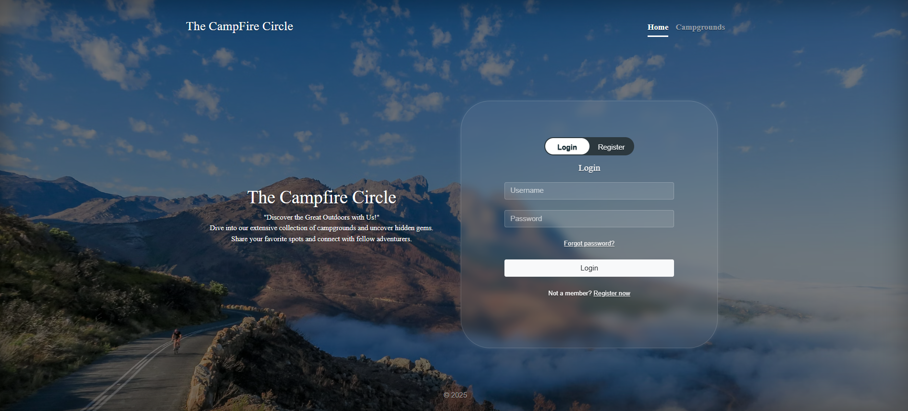

# The CampFire
<h2>Project Overview – <I>The Campfire Circle</I></h2>
 
The Campfire Circle is a full-stack web application that allows users to explore, share, and review campgrounds from different locations. The project is designed to serve as a community platform for camping enthusiasts to connect, discover hidden outdoor spots, and exchange real experiences. 

##

<li><I>User Authentication</I>: 
Users can register and log in with their credentials. Authenticated users gain access to campground creation and reviewing functionalities.

<li><I>Campground Listing</I>:
View a curated list of campgrounds submitted by users from various locations.

<li><I>Add New Campgrounds</I>:
Authenticated users can add new campgrounds with details and optional images.

<li><I>Review System</I>:
Logged-in users can submit reviews on campgrounds to share their experiences.

##
## 📸 UI Preview

Here’s a look at the user interface of the project:

### 🏠 Home Page

## 🛠️ Tech Stack

- Frontend: HTML, CSS, JavaScript (EJS)
- Backend: Node.js, Express.js
- UI: Clean, responsive layout with toggled login/register

